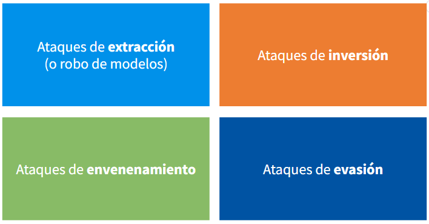
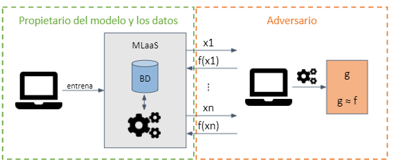
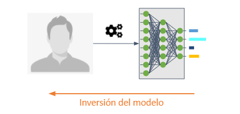
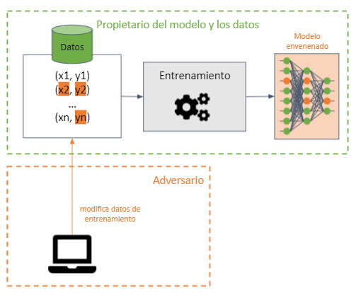
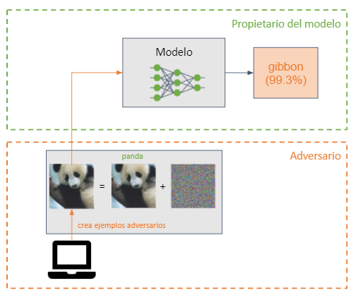
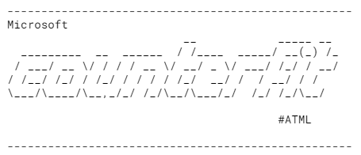
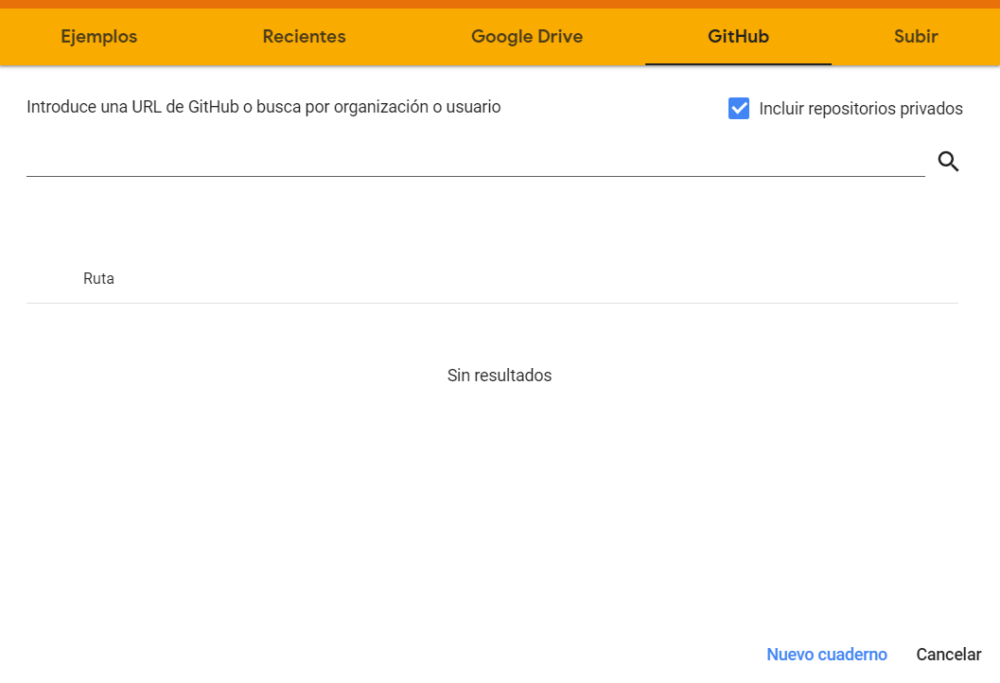
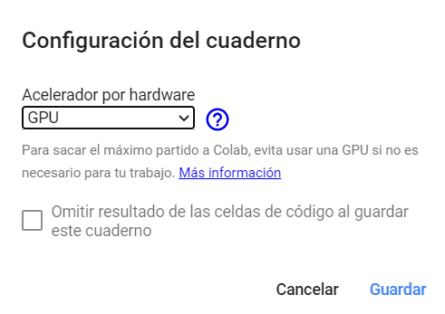

# Introducción al Adversarial Machine Learning

[Charla de Adversarial Machine Learning](TBD) para [DragonJAR 2022](https://www.dragonjarcon.org).

  

    
  

## ¿Qué es el Adversarial Machine Learning?

El [Adversarial Machine Learning](https://en.wikipedia.org/wiki/Adversarial_machine_learning) es la rama del machine learning que trata de averiguar los ataques que puede sufrir un modelo en la presencia de un adversario malicioso y cómo protegerse de ellos.

### Taxonomía de ataques

El Adversarial Machine Learning establece que existen 4 tipos de ataque que pueden sufrir los modelos de ML.

  

    
  

* Extracción (o robo) de modelo: permiten a un adversario robar los parámetros de un modelo de machine learning.
  

    
  

  
* Inversión: tienen como objetivo invertir el flujo de información de un modelo de machine learning. Permiten a un adversario tener un conocimiento del modelo que no pretendía ser compartido de forma explícita.
  

    
  

* Envenenamiento: buscan corromper el conjunto de entrenamiento haciendo que un modelo de machine learning reduzca su precisión. Pueden añadir puertas traseras en el modelo.
  

    
  

  
* Evasión: un adversario inserta una pequeña perturbación (en forma de ruido) en la entrada de un modelo de machine learning para que clasifique de forma incorrecta (ejemplo adversario).
  

    
  

## Herramientas empleadas

* [Adversarial Robustness Toolkit (ART)](https://adversarial-robustness-toolbox.readthedocs.io/en/latest): es una librería opensource de Adversarial Machine Learning que permite comprobar la robustez de los modelos de machine learning. Está desarrollada en Python e implementa ataques y defensas de extracción, inversión, envenenamiento y evasión. ART soporta los frameworks más populares: Tensorflow, Keras, PyTorch, MxNet, ScikitLearn, entre muchos otros). Además, no está limitada al uso de modelos que emplean imágenes como entrada, sino que soporta otros tipos de datos como audio, vídeo, datos tabulares, etc.

  

    
  

  
* [Counterfit](https://github.com/Azure/counterfit) es una CLI escrita en Python y desarrollada por Microsoft. Desarrollada para auditorías de seguridad sobre modelos de ML. Implementa algoritmos de evasión de caja negra. Se basa en los ataques de las herramientas ART y [TextAttack](https://github.com/QData/TextAttack).

  

    
  

## Notebooks

> Todos los notebooks se pueden ejecutar más rápidamente empleando una GPU. 
> Se recomienda el uso de [Colab](https://colab.research.google.com), que permite emplear GPUs de forma gratuita y no tener que instalar nada en el equipo.
>
> 

>    
> 

La carpeta `notebooks` contiene 5 notebooks que cubren ataques de extracción, inversión, envenenamiento y evasión en ART.

* `art_install.ipynb`: contiene la instalación de ART y verificar que todo funciona correctamente.
* `evasion.ipynb`: contiene cómo realizar ejemplos adversarios (no dirigidos y no dirigidos) y cómo proteger los modelos frente a ellos.
* `inversion.ipynb`: contiene un ataque de inversión, que permite inferir datos de entrenamiento.
* `poisoning.ipynb`: contiene cómo generar una puerta trasera en un modelo y cómo defenderse de ella.
* `extraction.ipynb`: contiene cómo robar un modelo y aplicar defensas para minimizar el robo.

El orden en el que se ejecuten los notebooks es irrelevante, pero es recomendable comenzar por `art_install`.

En el mismo directorio, se encuentra el fichero `counterfit.md`, que muestra cómo instalar `counterfit` en una máquina local y el uso básico de la CLI.  

## Importar notebooks en Colab

1. Entrar en [Google Colab](https://colab.research.google.com), iniciando sesión con una cuenta de `Google`.

2. Importar todos los notebooks de este repositorio usando la pestaña `GitHub`, copiando la url de este repositorio.
  

    
  

3. Cambiar el entorno de ejecución a `GPU`. Se realiza desde el menú `Entorno de ejecución` > `Cambiar entorno de ejecución`. Esto acelera la ejecución de los notebooks.
  

    
  

## Crédito

Los notebooks de inversión y envenenamiento se basan en los [ejemplos](https://github.com/Trusted-AI/adversarial-robustness-toolbox/tree/main/examples) y [notebooks](https://github.com/Trusted-AI/adversarial-robustness-toolbox/tree/main/notebooks) proporcionados por ART. 

# Ediciones anteriores

[Taller de Adversarial Machine Learning](./presentations/CCN-CERT_2021_Introducción_al_Adversarial_Machine_Learning.pdf)  para las [XV Jornadas STIC CCN-CERT](https://www.ccn-cert.cni.es/xvjornadas).

  

    
  

